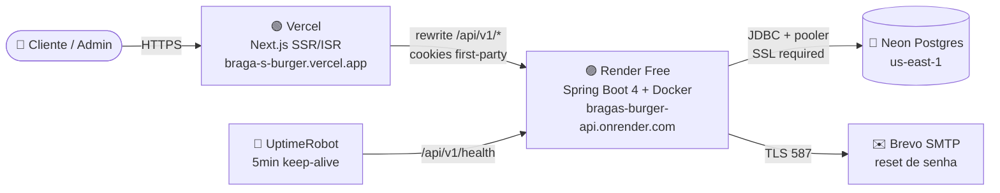

# Braga's Burger

> Plataforma completa de pedidos online para uma hamburgueria artesanal da Zona Norte do Rio de Janeiro. Da landing page ao painel administrativo, do banco em produção ao deploy em multi-cloud — entregue como um trabalho real para um cliente real.

[](https://nextjs.org/)
[](https://react.dev/)
[](https://spring.io/projects/spring-boot)
[](https://openjdk.org/)
[](https://www.postgresql.org/)
[](https://www.typescriptlang.org/)
[](https://tailwindcss.com/)

🔗 **Demo ao vivo:** [braga-s-burger.vercel.app](https://braga-s-burger.vercel.app)

---

## O que é

Um sistema **full-stack** que substitui o fluxo de pedido por WhatsApp por uma experiência web própria — com cardápio dinâmico, carrinho, checkout, autenticação de cliente, fila de pedidos em tempo real e painel administrativo. Hospedado em produção e operacional.

Construído de forma incremental em **6 sub-projetos**, cada um com spec, plano e code review próprios.

## Stack

| Camada | Tecnologia |
|---|---|
| **Frontend** | Next.js 16 (App Router) · React 19 · TypeScript · Tailwind CSS v4 · Framer Motion · Zustand · Embla Carousel |
| **Backend** | Spring Boot 4 · Java 21 LTS · Gradle Kotlin DSL · Spring Security + JWT · Flyway · Bucket4j (rate limit) |
| **Banco** | PostgreSQL 16 · Schema normalizado com migrations versionadas (V1–V6) |
| **E-mail** | Brevo (SMTP transacional) · Spring Mail `@Async` |
| **Infra prod** | Vercel (frontend) · Render Free (backend Docker) · Neon (Postgres us-east-1) · UptimeRobot (keep-alive) |
| **Testes** | Vitest + Testing Library (front) · JUnit 5 + Testcontainers (back) — **427 testes verdes** |

## Arquitetura em produção



**Decisão central:** Vercel **rewrites** `/api/v1/*` → Render. Isso faz os cookies `bb_session`/`bb_admin` ficarem **first-party** em `vercel.app` — resolvendo o bloqueio de cookies cross-site do Safari/iPhone (ITP).

## Sub-projetos

| # | Escopo | Status | PR |
|---|---|---|---|
| **SP1** | Landing page com cardápio, vídeo de fundo, animação de intro | ✅ | [#2](https://github.com/BrunoOAlm/Braga-s-Burger/pull/2) |
| **SP2** | Carrinho (Zustand + localStorage), checkout multi-etapa, OrderStatusScreen estilo iFood | ✅ | [#3](https://github.com/BrunoOAlm/Braga-s-Burger/pull/3) |
| **SP3** | Backend de pedidos (Java 21 + Spring 4 + Postgres), 4 endpoints REST, recálculo server-side | ✅ | [#4](https://github.com/BrunoOAlm/Braga-s-Burger/pull/4) |
| **SP4a** | Integração front↔backend, polling do status do pedido | ✅ | [#5](https://github.com/BrunoOAlm/Braga-s-Burger/pull/5) |
| **SP4b** | Auth de cliente (cookie httpOnly JWT 7d), reset de senha por email, rate limit | ✅ | [#7](https://github.com/BrunoOAlm/Braga-s-Burger/pull/7) |
| **SP5a** | Catálogo dinâmico no DB, cupons validados server-side, CRUD admin (header-token) | ✅ | [#8](https://github.com/BrunoOAlm/Braga-s-Burger/pull/8) |
| **SP5b** | Auth admin por sessão (cookie `bb_admin` separado, audit log com actor) | ✅ | [#9](https://github.com/BrunoOAlm/Braga-s-Burger/pull/9) |
| **SP5b.1** | Hardening do bootstrap: gera bcrypt em runtime, valida formato no startup, fail-fast | ✅ | [#10](https://github.com/BrunoOAlm/Braga-s-Burger/pull/10) |
| **SP5c** | Painel admin completo: fila de pedidos em tempo real (polling + bip), CRUDs de produto/categoria/cupom | ✅ | [#11](https://github.com/BrunoOAlm/Braga-s-Burger/pull/11) |
| **SP6a** | Deploy MVP em produção: Vercel + Render + Neon + Brevo + UptimeRobot | ✅ | [#12](https://github.com/BrunoOAlm/Braga-s-Burger/pull/12) |
| **SP6b** | Hardening prod: CI, IP allowlist, WAF, backup automatizado, domínio próprio | 🔜 | — |

Detalhes técnicos de cada sub-projeto em [`docs/superpowers/specs/`](./docs/superpowers/specs/) e [`docs/superpowers/plans/`](./docs/superpowers/plans/).

## Destaques técnicos

- **Cookies cross-environment funcionando no Safari** — Vercel rewrite torna o backend "same-origin" do ponto de vista do browser, eliminando dor de cabeça com `SameSite=None`.
- **Rate limiting com Bucket4j** — `/auth/*` 5/min, `/coupons/validate` 60/min, `/admin/**` 30/min. Servlet filter escreve 429 direto (bypass do `@ControllerAdvice` por design).
- **Auth dupla isolada** — cliente (`bb_session`) e admin (`bb_admin`) coexistem; teste de integração `CrossCookieIsolationIT` garante que um não autentica como o outro.
- **Migrations Flyway versionadas** — V1 base, V2 users, V3 orders.user_id, V4 categories+products+coupons, V5 admin_users, V6 remove seed legacy.
- **Bootstrap admin com hash em runtime** — `passwordEncoder.encode()` na inicialização, validação de formato bcrypt no startup com fail-fast, evita comprometer hash em variável de ambiente.
- **Server Components consumindo API com ISR** — `app/page.tsx` é async RSC com `revalidate: 300`, com degradação graciosa (try/catch silencia para preservar marketing mesmo se backend cair).
- **Audit log com actor** — todas as mutações admin registram `actor=<admin_user_id>` (via `CurrentAdmin`).
- **Spring Boot 4 + Jackson 3** — refactor de `ObjectMapper` (não é mais autoconfigured) em testes de integração.

## Métricas

```
✅ 159 testes backend (JUnit 5 + Testcontainers)
✅ 268 testes frontend (Vitest + Testing Library)
✅ 6 migrations Flyway
✅ 84 produtos + 7 categorias seedados
✅ 39 bairros de delivery configurados
✅ Build de produção: 15 rotas estáticas
```

## Rodando localmente

### Pré-requisitos

- Node.js 20+
- Java 21 + Docker (para o Postgres via Docker Compose)
- `npm install`

### Comandos

```bash
# Frontend
npm run dev        # http://localhost:3000
npm test           # vitest
npm run lint
npm run build

# Backend (em outro terminal)
cd backend
docker compose up -d postgres   # Postgres na porta 5433
./gradlew bootRun               # API em http://localhost:8080
./gradlew test                  # JUnit 5 + Testcontainers
```

Crie um `.env.local` na raiz com `BACKEND_URL=http://localhost:8080` para o rewrite funcionar igual à produção.

## Deploy

O deploy é totalmente reprodutível seguindo o plano em [`docs/superpowers/plans/2026-06-09-sp6a-deploy-mvp.md`](./docs/superpowers/plans/2026-06-09-sp6a-deploy-mvp.md). Resumo:

1. **Neon** — criar projeto Postgres (Pooled connection)
2. **Brevo** — criar SMTP key + verificar sender
3. **Render** — Web Service Docker, Root Directory `backend`, 19 env vars
4. **Vercel** — importar repo, `BACKEND_URL` env var, deploy
5. **UptimeRobot** — monitor a cada 5min direto no Render

## Roadmap próximo (SP6b)

- [ ] CI no GitHub Actions: lint + test + typecheck
- [ ] IP allowlist em `/admin/**`
- [ ] Cloudflare WAF + cache
- [ ] Backup automatizado do Neon (PITR + export periódico)
- [ ] `TZ=America/Sao_Paulo` no Render (corrige divergência de fuso "loja fechada")
- [ ] Domínio próprio + SPF/DKIM no Brevo (`no-reply@<dominio>`)
- [ ] Secrets em vault (Doppler / Infisical)

## Autor

**Bruno Oliveira de Almeida** — [GitHub](https://github.com/BrunoOAlm) · [LinkedIn](https://linkedin.com/in/brunoalm)

Este projeto foi desenvolvido por mim como freelancer para a **Braga's Burger**, hamburgueria artesanal de Higienópolis (RJ). Conteúdo do negócio (cardápio, fotos, textos jurídicos) é responsabilidade do cliente.
